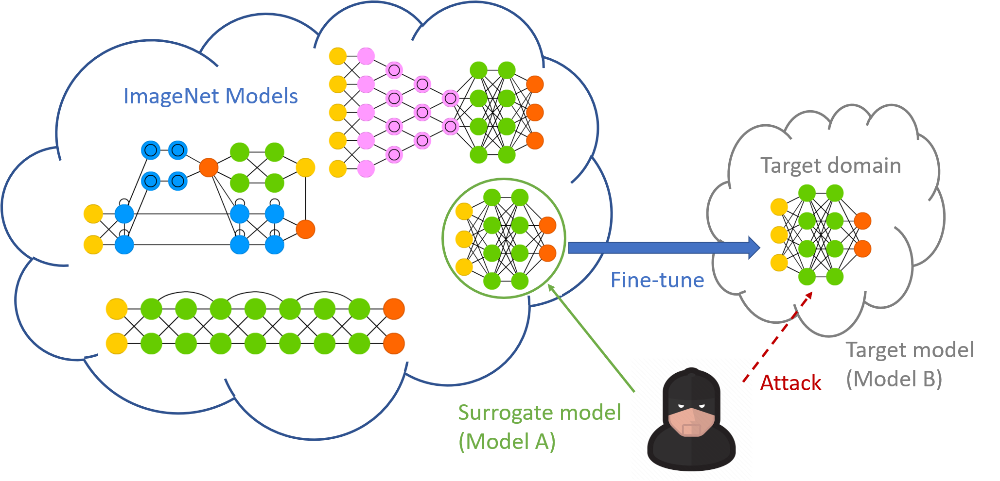
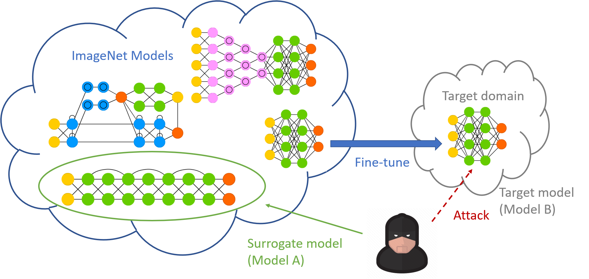

# TES
Code of CIKM 2022 paper "Cross-domain Cross-architecture Black-box Attacks on Fine-tuned Models with Transferred Evolutionary Strategies". 

## Introduction
### The Black-box Attacks on Fine-tuned Models (BAFT) Settings
Fine-tuned models are prevalent, but they are vulnerable to adversarial attacks. 

We propose two novel BAFT settings, cross-domain and cross-domain cross-architecture BAFT (CD-BAFT and CDCA-BAFT), which assume that (1) the target model for attacking is a fine-tuned model, and (2) the source domain data is known and accessible (usually ImageNet). 

Suppose the target model for attack is a VGG16 flower classifier fine-tuned from a VGG16 ImageNet classifier. If the attacker coincidentally chooses the VGG16 ImageNet classifier, it corresponds to the CD-BAFT setting. If the attacker uses a source model whose architecture is different from the VGG16 network, for example, a ResNet50 ImageNet classifier, it corresponds to the CDCA-BAFT setting. 

CD-BAFT



CDCA-BAFT




### The Transferred Evolutionary Strategies (TES) Method
To effectively and efficiently attack a fine-tuned model, we develop a two-stage attack method. We first train an adversarial generator against the source model, which adopts an encoder-decoder architecture and maps a clean input to an adversarial example. Then we search in the low-dimensional latent space produced by the encoder of the adversarial generator. The search is conducted under the guidance of the surrogate gradient obtained from the source model. 

## Dependencies
- PyTorch >= 1.0
- Python3

## Prepare Datasets
### Fine-tuning tasks
Four fine-tuning tasks are constructed from the [Office-Home](http://hemanthdv.org/OfficeHome-Dataset/) dataset. There are four domains in the dataset, namely `Art`, `Clipart`, `Product`, and `Real World`. The target models for attack are trained in these domains. 

For each domain, please create a txt file that lists the image file names and their labels in the `datasets/office-home` folder. Each line in the txt file is structured as "image_file_path label". A dummy example of the `Art` domain can be found in the `datasets/office-home` folder. 

### ImageNet validation dataset
We train the adversarial generator on the validation set of the ImageNet dataset. There are 50K images in the validation set. Please randomly split it into a training set (49K images) and a test set (1K images). Put the image paths and labels in txt files in the `datasets/imagenet-val` folder. Similarly, each line is structured as "image_file_path label". 

## Training classifiers
To fine-tune a classifier from an ImageNet classifier, use the `train_cls.py` script. 

For example, to fine-tune a VGG16 network on the `Art` domain, the following command can be used. 

```
python train_cls.py --dataset Art \
                    --arch VGG16 \
                    --output_dir <output_path> \
                    --lr 1e-3 \
                    --wd 1e-4 \
                    --epochs 50 \
                    --imagenet_pretrain
```

The learning rate is selected from {1e-2, 1e-3, 3e-4}, and the weight decay is selected from {1e-6, 1e-5, 1e-4}. The model that achieves the highest accuracy on the test set is used as the target model. 

## TES
### Stage I: training an adversarial generator
The adversarial generator is trained on the ImageNet validation set. 

To train an adversarial generator for untargeted attacking a VGG16 ImageNet classifier, the following command can be used. 
```
python train_generator.py --dataset imagenet-val \
                    --arch VGG16 \
                    --output_dir <output_path> \
                    --g_arch conv \
                    --lr 0.01 \
                    --epochs 150 \
                    --attack_type untargeted \
                    --eps 8
```

The following command trains an adversarial generator that targeted attacks a VGG16 ImageNet classifier (use `TV` as target, making the model classify non-TV images as TVs, label=851 in the ImageNet dataset): 
```
python train_generator.py --dataset imagenet-val \
                    --arch VGG16 \
                    --output_dir <output_path> \
                    --g_arch conv \
                    --lr 0.01 \
                    --epochs 150 \
                    --attack_type class-targeted \
                    --target_label 851 \
                    --eps 8
```

The learning rate is selected from {1e-2, 1e-3}. 

### Stage II: attack with TES
Finally, we attack the target model under the guidance of a source model. 

To perform untargeted CD-BAFT towards a VGG16 network fine-tuned on the `Art` domain, the following command can be used. 
```
python tes.py --dataset Art \
	            --arch_a VGG16 \
	            --imagenet_pretrain \
	            --arch_b VGG16 \
	            --ckpt_b <path to load the fine-tuned model> \
	            --g_arch conv \
	            --g_path <path to load the adversarial generator> \
	            --attack_type untargeted \
	            --alpha 0.5 \
	            --eps 8
```

To perform targeted CD-BAFT towards a VGG16 network fine-tuned on the `Art` domain, the following command can be used. 
```
python tes.py --dataset Art \
	            --arch_a VGG16 \
	            --imagenet_pretrain \
	            --imagenet_target_label 851 \
	            --arch_b VGG16 \
	            --ckpt_b <path to load the fine-tuned model> \
	            --g_arch conv \
	            --g_path <path to load the adversarial generator> \
	            --attack_type class-targeted \
	            --target_label <label of TV in the office-home dataset> \
	            --alpha 0.5 \
	            --eps 8
```

To use a ResNet50 ImageNet model as the source model, use `--arch_a ResNet50` instead. 

The hyperparameters of TES, `alpha`, `beta`, `sigma`, are selected from {0.1, 0.5, 0.75}, {1, 2}, and {0.1, 1}, respectively. 

## Citation
If you use this code, please consider citing our paper: 

```
Yinghua Zhang, Yangqiu Song, Kun Bai, Qiang Yang. Cross-domain Cross-architecture Black-box Attacks on Fine-tuned Models with Transferred Evolutionary Strategies. In: Proceedings of the 31st ACM International Conference on Information and Knowledge Management (CIKM '22), Atlanta, GA, USA, 2022. 
```

## Contact
Yinghua Zhang (yzhangdx@outlook.com)
